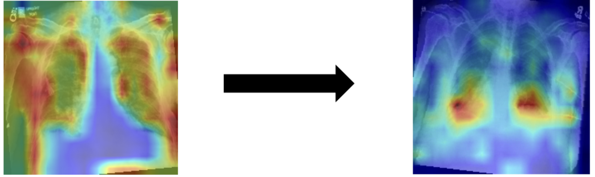

Transformer For Medical AI

Abstract
We utilized the CheXpert dataset, a large-scale chest X-ray dataset, to diagnose chest conditions based on 14 labels and to localize pathological regions using heatmaps. To achieve this, we applied three vision transformer models—ViT, BEiT, and Swin. 

Initial experiments conducted on a test subset showed that the ViT Transformer model achieved the highest accuracy. Based on this result, we employed the ViT model on the full dataset to further improve diagnostic performance and enhance the precision of heatmap-based localization.

Figure 1(presents the performance of three vision transformer models—ViT, BEiT, and Swin—evaluated using a subset of the test dataset. Although the Swin model demonstrated high accuracy during training, it showed poor and unstable performance on the test set. The BEiT model achieved higher test accuracy than the ViT model; however, the ViT model exhibited more consistent improvement in accuracy as the number of epochs increased and showed better performance during training. Based on this trend, we hypothesized that the ViT model would achieve further improvement when trained on the full dataset. Therefore, we selected the ViT model for our final experiments.)

Figure 2(shows the results of training and testing the ViT model using the full dataset, based on the findings from Figure 1. However, no significant improvement was observed in performance.)

Figure 3(The CLS token, which is trained to aggregate global information from the entire image, can be used to generate 2D heatmaps by visualizing the attention scores assigned to each patch. Figure 3 illustrates how the attention maps evolve as the model improves: the earlier model fails to focus accurately on the lesion, while the updated model correctly identifies disease-relevant regions.)

👉 [Final Presentation File](./Transformers for Medical AI.pdf)
